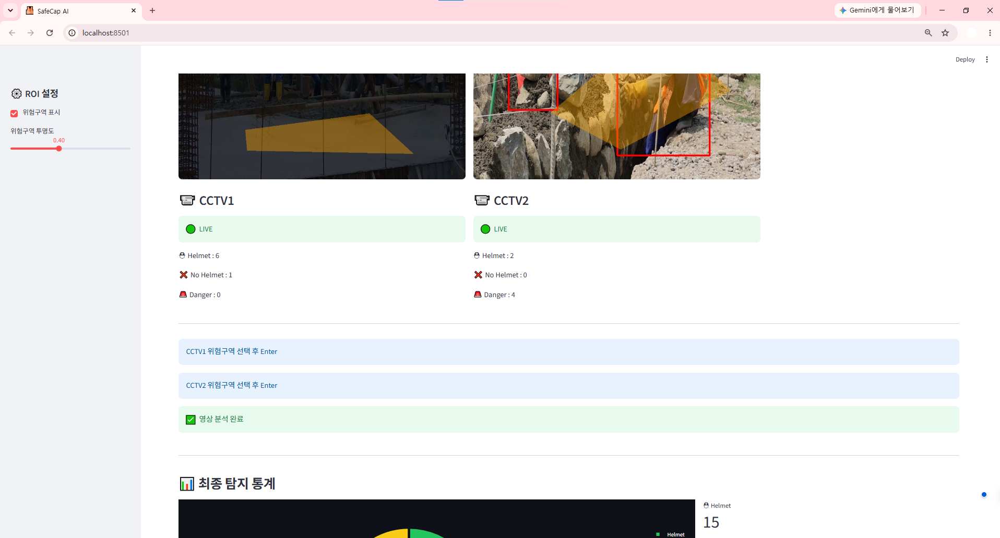
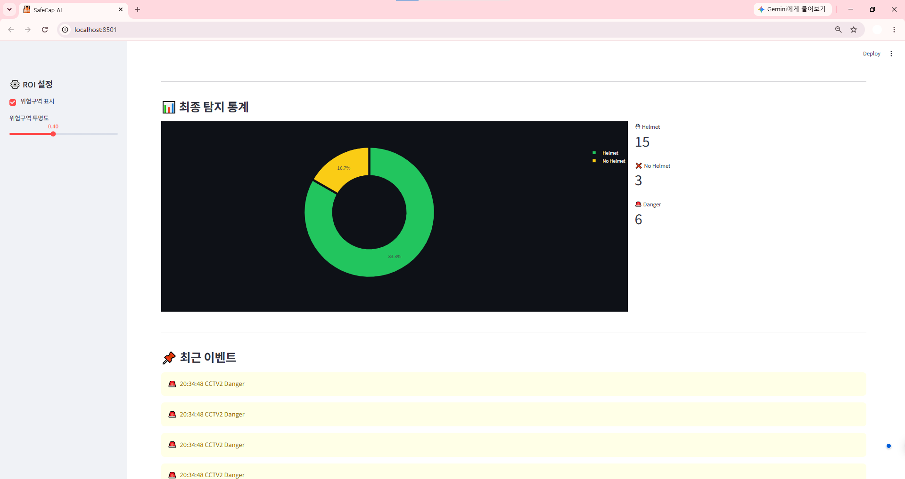

# 🦺 SafeCap AI

공사장 작업자의 안전모 착용 여부와 위험구역 진입을 실시간으로 확인할 수 있는 AI 기반 안전 모니터링 시스템입니다.

---

# 프로젝트 소개

공사장에서는 안전모 미착용이나 위험구역 출입으로 인해 다양한 안전사고가 발생할 수 있습니다. 이러한 문제를 조금이라도 줄이기 위해 CCTV 영상을 활용하여 작업자의 안전 상태를 자동으로 분석하는 시스템을 구현했습니다.

SafeCap AI는 업로드한 영상을 분석하여 작업자(Person), 안전모(Helmet), 안전모 미착용(No Helmet)을 탐지하고, 사용자가 지정한 위험구역(ROI)에 작업자가 들어갈 경우 화면에 경고를 표시하고 로그를 기록합니다.

또한 두 개의 영상을 동시에 분석할 수 있도록 구성하여 여러 장소를 한 번에 모니터링할 수 있으며, 객체 추적(ByteTrack)을 적용하여 동일한 작업자를 지속적으로 추적하도록 구현했습니다.

---

# 주요 기능

- CCTV 영상 2개를 동시에 분석할 수 있도록 구현하였습니다.
- 작업자와 안전모를 탐지하여 안전모 착용 여부를 확인할 수 있습니다.
- 안전모를 착용하지 않은 작업자를 별도로 표시하여 쉽게 확인할 수 있습니다.
- ByteTrack을 적용하여 동일한 작업자를 지속적으로 추적하도록 구현하였습니다.
- 사용자가 위험구역(ROI)을 직접 설정할 수 있습니다.
- 작업자가 위험구역에 진입할 경우 화면에 경고를 표시하고 이벤트 로그를 저장합니다.
- 실시간으로 탐지 현황을 확인할 수 있으며, 분석 결과를 통계 형태로 제공합니다.
---

# 실행 화면

### 메인 화면


### 객체 탐지



### 결과 화면



---

# 개발 환경

| 구분      | 내용                                        |
| --------- | ------------------------------------------- |
| Language  | Python 3                                    |
| IDE       | Visual Studio Code                          |
| Framework | Streamlit (1.58.0)                          |
| Model     | YOLOv8 (Ultralytics 8.4.70, Custom Trained) |
| Tracking  | ByteTrack                                   |
| Library   | OpenCV, PyTorch                             |

---

# 의존성

프로젝트 실행에 필요한 라이브러리는 requirements.txt 파일에 정리되어 있습니다.

bash
pip install -r requirements.txt


---

# 설치 및 실행 방법

### 1. 저장소 다운로드

bash
git clone https://github.com/shiniseul6/computervision.git
cd computervision


### 2. 가상환경 생성

bash
python -m venv venv


### 3. 가상환경 실행

bash
venv\Scripts\activate


### 4. 라이브러리 설치

bash
pip install -r requirements.txt


### 5. 프로그램 실행

bash
streamlit run app.py


브라우저에서 Streamlit 페이지가 열리면 분석할 영상을 업로드하여 사용할 수 있습니다.

---

# 데이터 처리 과정

```text
영상 입력
   │
   ▼
프레임 추출(OpenCV)
   │
   ▼
YOLO 객체 탐지
(Person / Helmet / No Helmet)
   │
   ▼
ByteTrack 객체 추적
   │
   ▼
위험구역(ROI) 침입 여부 확인
   │
   ▼
탐지 결과 화면 출력
   │
   ▼
로그 저장 및 통계 생성
```

---

# 프로젝트 구조
```text
computervision
│
├── app.py
├── detector.py
├── processor.py
├── roi.py
├── roi_selector.py
├── bestv2.pt
├── requirements.txt
├── README.md
└── images
    ├── main
    ├── detect.png
    └── dashboard.png
```

---

# 팀원 역할

| 이름  | 담당 내용                                        |
| --- | -------------------------------------------- |
| 신이슬 | 객체 탐지 모델 학습, UI 구현, 기능 최적화                |
| 오유진 | 객체 탐지 모델 학습, UI 설계, 위험구역 설정 기능 구현 |

---

# 기대 효과

* 작업자의 안전모 착용 여부를 자동으로 확인할 수 있다.
* 위험구역 출입 상황을 실시간으로 확인하여 현장 안전관리에 활용할 수 있다.
* 반복적인 CCTV 모니터링 부담을 줄이고 관리 효율을 높일 수 있다.
* 실시간 로그와 통계를 제공하여 사고 예방 및 사후 관리에 도움을 줄 수 있다.
